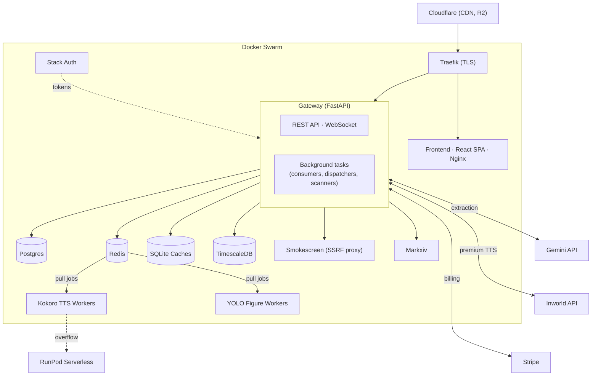
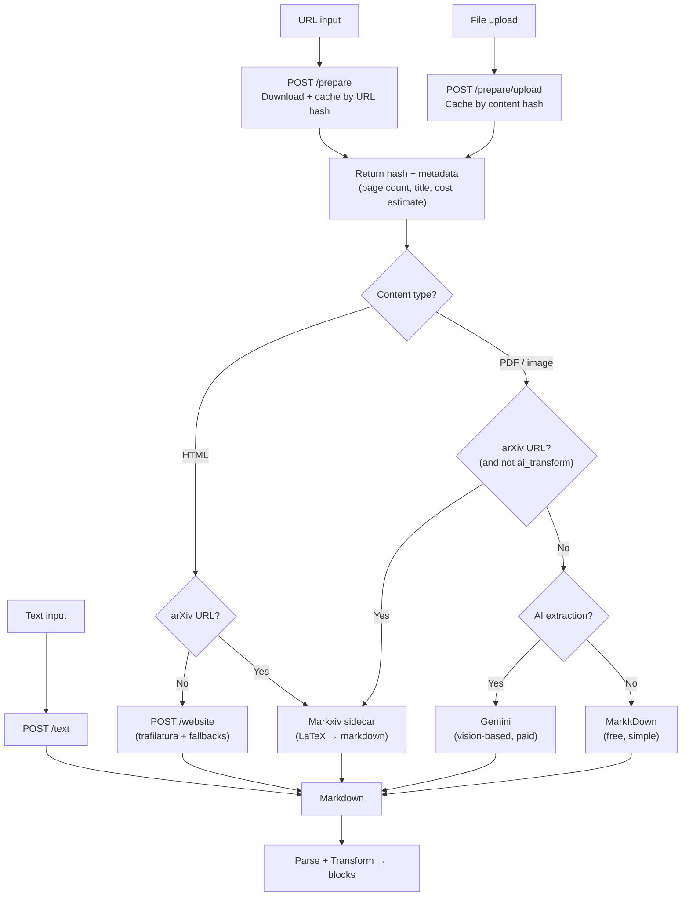
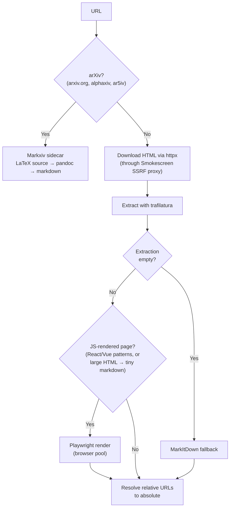
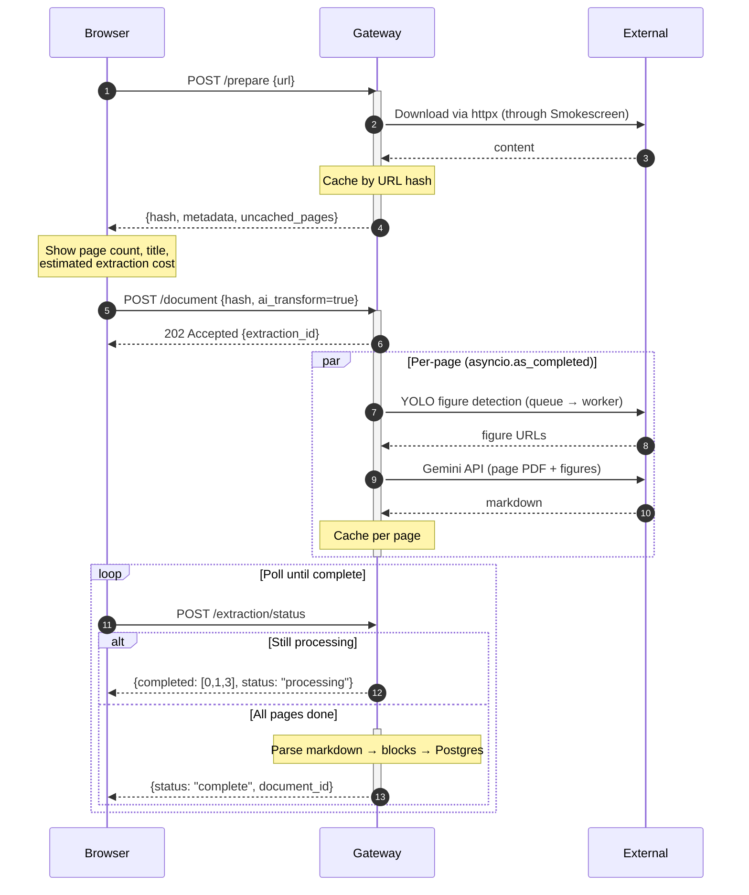
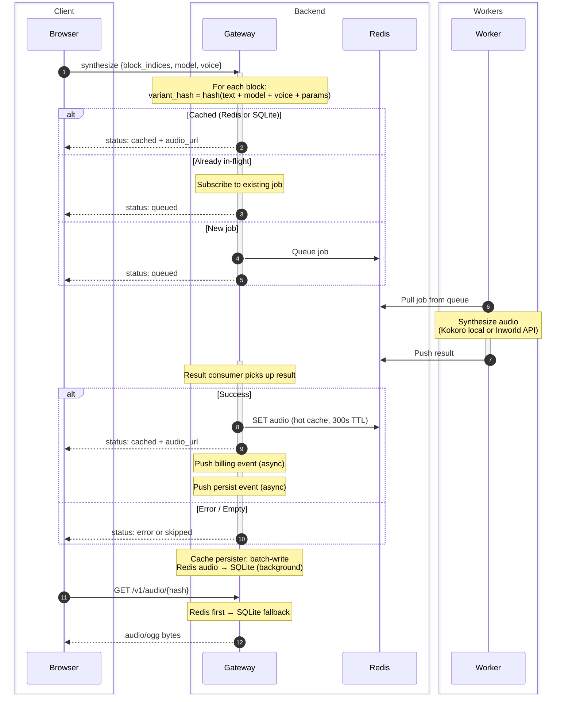
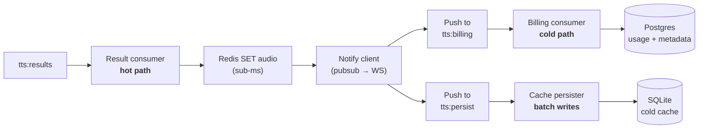
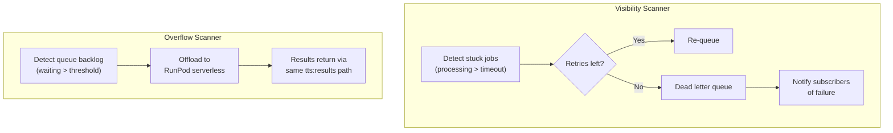

# Yapit Architecture

## System Overview



**Gateway** is a FastAPI process handling all HTTP/WebSocket traffic plus
background tasks (result consumer, billing consumer, cache persister,
Inworld dispatchers, visibility/overflow scanners). Only service with
Postgres access.

**Workers** pull jobs from Redis queues and push results back. The gateway
never pushes to workers directly — any machine with Redis access can be a
worker. Kokoro and YOLO run as separate containers. Inworld dispatchers run
inside the gateway (just HTTP calls).

**Storage:**

| Store | Role |
|-------|------|
| Redis | Job queues, inflight tracking, pubsub, audio hot cache (300s TTL) |
| SQLite | Audio cold cache (persistent, LRU-evicted), document cache, extraction cache |
| Postgres | Documents, blocks, variants, billing, user data |
| TimescaleDB | Metrics and events |


## Document Processing

### Input paths

Content enters as URLs, file uploads, or raw text. All paths produce markdown.



Document creation is two steps: `/prepare` downloads and caches content,
returning metadata (page count, title, cost estimate). The frontend shows
this to the user, then calls the create endpoint with the cache key.

### Website extraction



### AI extraction

Gemini vision-based extraction for PDFs and images. Pages are processed in
parallel, cached per-page — re-extracting a 100-page PDF where 3 pages
changed only re-processes those 3. YOLO figure detection runs first to
identify charts, diagrams, and figures that PyMuPDF can't extract.



Batch mode submits all pages to the Gemini Batch API instead (50% cost
reduction), with a background poller checking for completion.

### Markdown → blocks

Parsed by markdown-it-py (CommonMark + extensions). The transformer walks
the AST and produces typed blocks with HTML for display and audio chunks
for TTS. Speakable block types: heading, paragraph, list, blockquote,
image captions, footnotes. Non-speakable: code, math, tables.

Custom HTML tags route content between display and speech:
`<yap-show>` (display only), `<yap-speak>` (TTS only),
`<yap-cap>` (image captions, both). Long blocks are split at sentence →
clause → word boundaries to keep synthesis chunks short.


## TTS Pipeline

Two synthesis paths, same interface:
- **Server**: WebSocket → Redis queue → worker → result consumer → cached audio over HTTP
- **Browser**: Kokoro.js in a Web Worker (WASM/WebGPU). Audio stays in memory. Free, private, Kokoro-only.

### Synthesis lifecycle



### Result processing

Three isolated consumers process results in parallel:



- **Result consumer** (hot path): Redis SET + notify. No disk I/O. Sub-ms.
- **Billing consumer**: Drain-on-wake batching. Own Postgres pool, can never starve the request path.
- **Cache persister**: Drain-on-wake batching. N rows in one SQLite transaction = one fsync instead of N.

### Workers

**Kokoro** (local model): Sequential processing, one job per replica. Runs
in its own container. Replica count scales with CPU cores.

**Inworld** (API model): Parallel dispatching inside the gateway. One async
task per job, unlimited concurrency.

### Reliability



### Frontend playback

State machine decoupled from React, bridged via `useSyncExternalStore`.
Prefetches 8 blocks ahead. Audio and synthesis are injected dependencies —
the engine doesn't know if audio came from server or browser synthesis.

Server synthesizer batches per-block calls into a single WebSocket message.
Audio playback uses `HTMLAudioElement` directly (not Web Audio API) because
`AudioBufferSourceNode.playbackRate` changes pitch with speed.


## Key Design Decisions

**Pull-based workers**: Workers pull from Redis queues. Faster workers
naturally pull more. Any machine with Redis access can be a worker. The
gateway doesn't need to know how many workers exist.

**Content-addressed cache**: Audio keyed by `hash(text + model + voice + params)`,
not by document or user. Two users reading the same article with the same
voice share cached audio.

**Redis-first audio serving**: Recently synthesized audio is served from
Redis (sub-ms). SQLite is the durable cold cache. The cache persister
batch-writes in the background — one fsync per batch instead of per row.

**Three-path result processing**: Hot path (Redis + notify) has zero disk
I/O. Billing and cache persistence run independently with their own
resources. No path can starve another.

**Duplicate prevention**: Inflight keys are atomically deleted at the start
of result processing. If a job completes twice (original + retry), only the
first to delete the key proceeds.

**Prepare/create split**: Document creation is two API calls. `/prepare`
downloads and caches content, returns metadata. The create endpoint uses
the cache key. Frontend shows costs before starting extraction.


## Deployment

Docker Compose with layered overrides:

```
docker-compose.yml              Base: all services + worker definitions
  └── docker-compose.dev.yml    Dev: host ports, volume mounts, stripe-cli
  └── docker-compose.prod.yml   Prod: Swarm mode, Traefik labels, ghcr.io images
```

Production runs on Docker Swarm (single node). CI/CD pushes to `main`
trigger lint, test, build, push to ghcr.io, SSH deploy, and health check.

Worker replica counts are configured via env vars. External workers connect
via Tailscale VPN.
