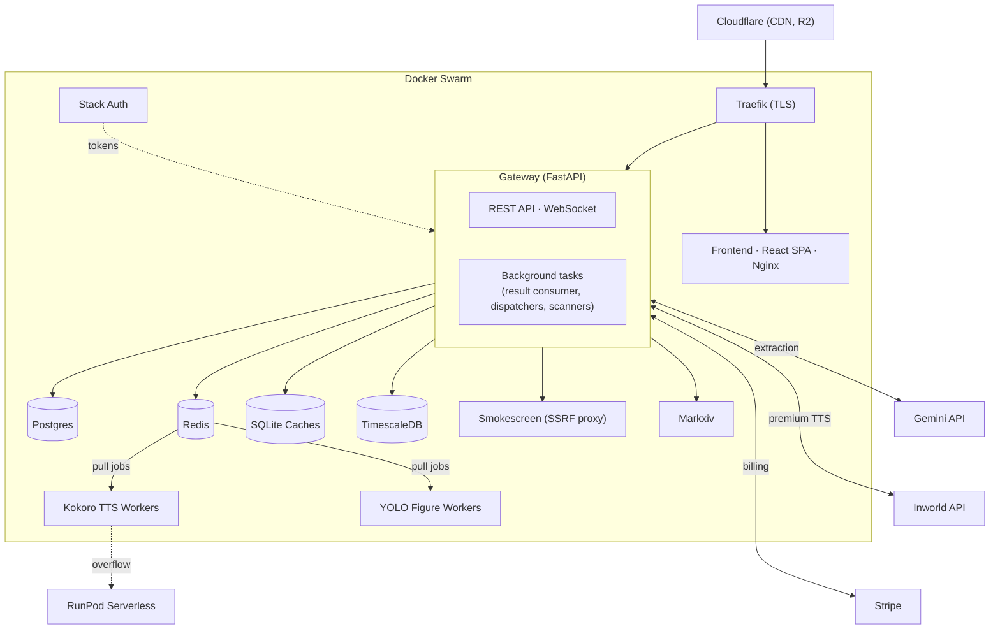
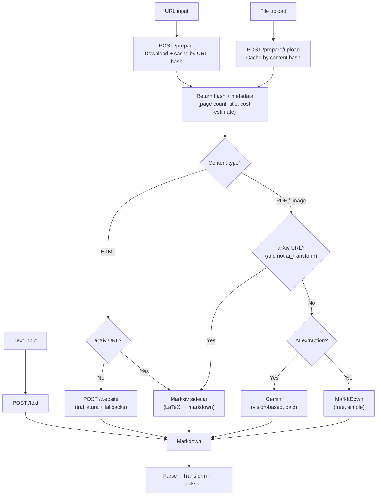
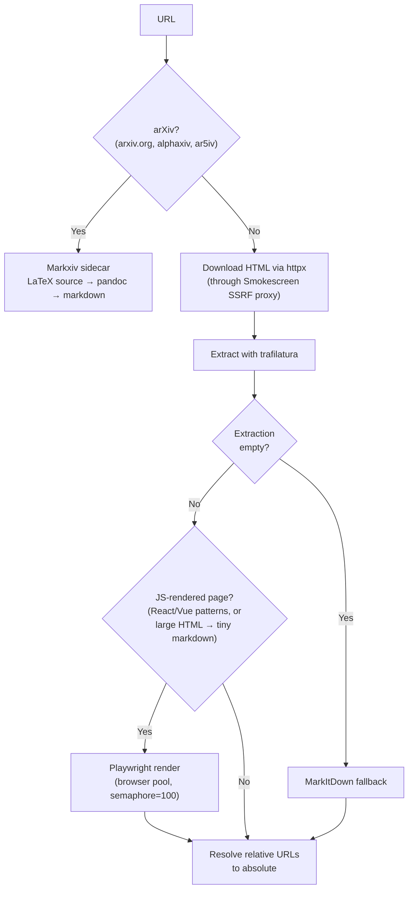
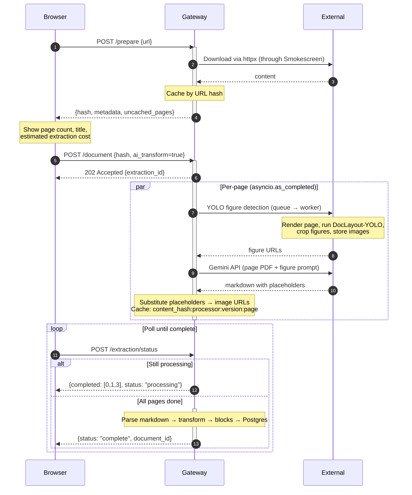
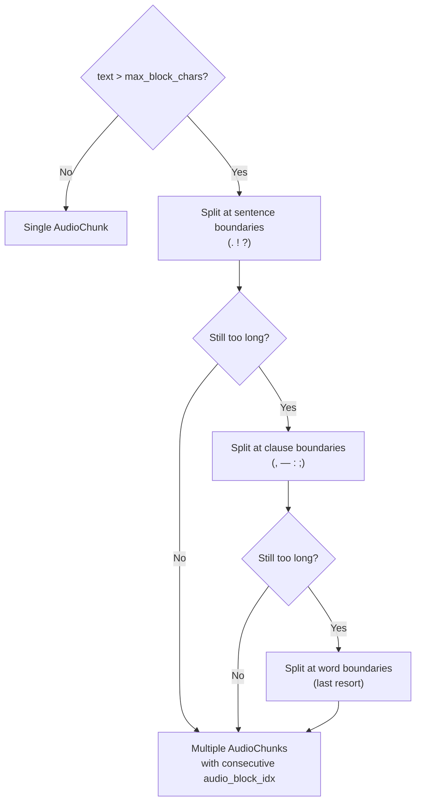
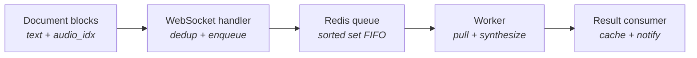
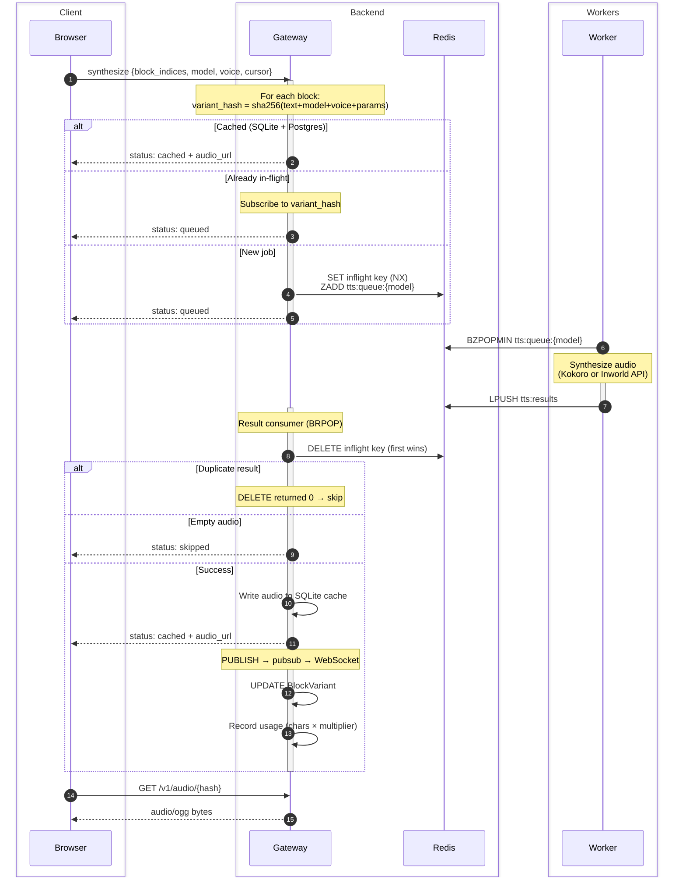
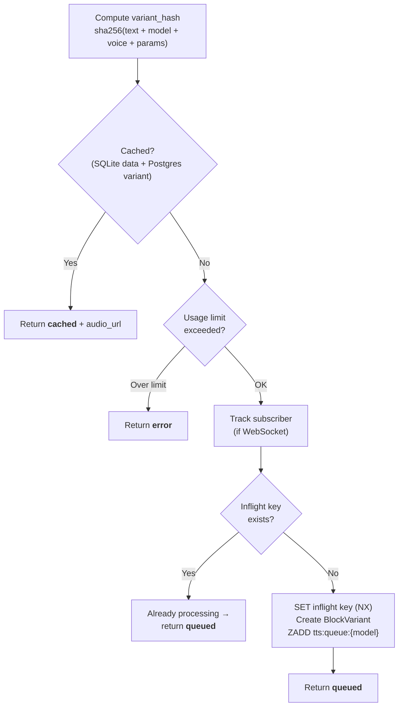
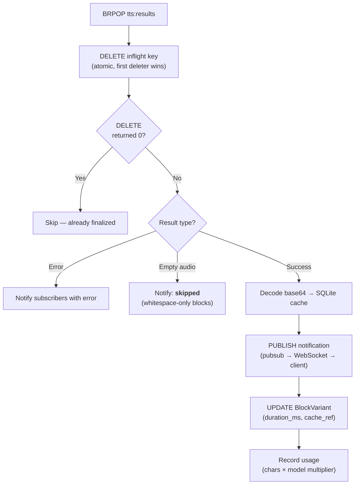
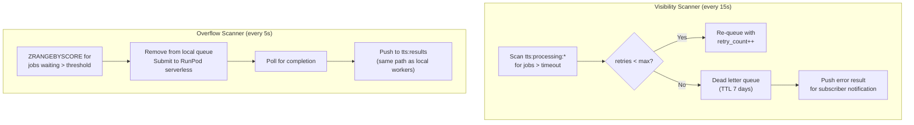

# Yapit Architecture

## System Overview



**Gateway** is a FastAPI process that handles all HTTP and WebSocket traffic.
It also runs background tasks (result consumer, Inworld dispatchers,
visibility/overflow scanners). Only service with Postgres access.

**Workers** pull jobs from Redis sorted sets via `BZPOPMIN` and push results
back. The gateway never pushes to workers directly. Any machine with Redis
access can run workers without gateway config changes. Kokoro and YOLO run
as separate containers. Inworld dispatchers run inside the gateway since
they're just HTTP calls to the Inworld API.

**Redis** stores job queues, inflight tracking, pubsub notifications, rate
limits, and async extraction state.

**SQLite caches** on the gateway filesystem (WAL mode):

| Cache | Keyed by | Eviction |
|-------|----------|----------|
| Audio | variant hash (sha256 of text+model+voice+params) | LRU, size-limited |
| Document | URL hash or content hash | TTL-based |
| Extraction | content_hash:processor:version:page | Prompt version bump |


## Document Processing

### Input paths

Content enters as URLs, file uploads, or raw text. All paths produce markdown.



Document creation is two steps: `/prepare` downloads and caches content,
returning metadata (page count, title, cost estimate). The frontend shows
this to the user, then calls the create endpoint with the cache key.

### Website extraction



### AI extraction (non-batch)

Gemini vision-based extraction for PDFs and images. Pages are processed in
parallel via `asyncio.as_completed`. Results are cached per-page, so
re-extracting a 100-page PDF where 3 pages changed only re-processes those 3.



Batch mode submits all pages to the Gemini Batch API instead (50% cost
reduction), with a background poller checking for completion.

**Why YOLO for figure detection?** PyMuPDF only extracts embedded raster
images. YOLO handles vector graphics, filters decorative elements, groups
multi-part figures, and provides layout info (width percentages, side-by-side
arrangement).

### Markdown parsing and block transformation

The markdown is parsed by `markdown-it-py` (CommonMark + tables + dollar
math + strikethrough + footnotes). `DocumentTransformer` walks the AST and
produces typed blocks with HTML for display and `AudioChunk`s for TTS:

| Block type | Speakable | Notes |
|------------|-----------|-------|
| heading    | yes       | H1-H6, split if long |
| paragraph  | yes       | Main content |
| list       | yes       | Per-item |
| blockquote | yes       | Callout title only |
| image      | caption   | `<yap-cap>` or alt text |
| footnotes  | yes       | Per-item, collected at document end |
| code       | no        | Displayed only |
| math       | no*       | Silent unless followed by `<yap-speak>` |
| table      | no        | Displayed only |

Custom HTML tags route content between display and speech:
`<yap-show>` (display only, silent), `<yap-speak>` (TTS only, invisible),
`<yap-cap>` (image captions, both displayed and spoken).

Long blocks are split to keep synthesis chunks short:



Split content gets multiple `AudioChunk` entries with consecutive
`audio_block_idx` values. The HTML wraps each chunk in
`<span data-audio-idx="N">` for playback highlighting.


## TTS Pipeline



Two synthesis paths:
- **Server synthesis**: the pipeline above. Workers produce audio, it's cached
  in SQLite, and the frontend fetches it over HTTP.
- **Browser synthesis**: Kokoro.js runs in a Web Worker (WASM/WebGPU). Audio
  stays in memory as an `AudioBuffer`. No server round-trip. Free, private,
  but limited to the Kokoro model.

Both implement the same `Synthesizer` interface. The playback engine does
not know which path produced the audio.

### Synthesis lifecycle



### Per-block synthesis flow



### WebSocket protocol

Single connection at `/v1/ws/tts` per session. Auth via query parameter.

```
Client → Server
──────────────────────────────────────────────────
synthesize     Request synthesis for a batch of blocks.
               {document_id, block_indices, cursor, model, voice}

cursor_moved   User skipped to a new position. Backend evicts
               queued blocks outside the buffer window.

Server → Client
──────────────────────────────────────────────────
status         Per-block update: queued | processing | cached | skipped | error
               Includes audio_url when cached.
               Includes model_slug + voice_slug (prevents stale updates
               after voice change).

evicted        Confirms which block indices were evicted.

error          Document-level error (not found, invalid model, rate limit).
```

### Queue structure

Each model gets its own Redis sorted set. Workers pop with `BZPOPMIN`
(oldest job first).

```
tts:queue:{model}                Sorted set. job_id → timestamp.

tts:jobs                         Hash. job_id → {retry_count, job JSON, queued_at}.
                                 Separated from queue so eviction can delete a
                                 job without scanning the sorted set.

tts:job_index                    Hash. "user:doc:block" → job_id.
                                 Cursor-based eviction looks up which job
                                 corresponds to a block, removes it.

tts:results                      List. Workers LPUSH results here.
                                 Result consumer BRPOPs from the other end.

tts:processing:{worker_id}       Hash. job_id → {started, retry_count, job, ...}.
                                 Visibility scanner checks these for stuck jobs.

tts:inflight:{variant_hash}      String with TTL. Prevents duplicate queuing.
                                 First request sets it; later requests subscribe.

tts:subscribers:{variant_hash}   Set. "user:doc:block" entries. When synthesis
                                 completes, notify all subscribers via pubsub.

tts:pending:{user}:{doc}         Set of block indices currently queued.
                                 Used by cursor_moved eviction.

tts:dlq:{model}                  Dead letter queue. TTL 7 days.
```

### Workers

**Kokoro** (local model): Sequential processing, one job per replica.
`BZPOPMIN` from queue, track in processing set, run KPipeline (text to
float32 PCM at 24kHz), encode to OGG Opus (PyAV/libopus), `LPUSH` result.
Runs in its own Docker container with a separate `pyproject.toml` (CPU and
GPU deps differ). Replica count scales with CPU cores.

**Inworld** (API model): Parallel dispatching, unlimited concurrency. Runs
as background tasks inside the gateway (not separate containers) since
they're just HTTP calls. Pull from `tts:queue:inworld-*`, spawn an async
task per job, POST to Inworld API with exponential backoff, re-encode the
returned OGG Opus, push result to `tts:results`.

### Result consumer



### Reliability



### Audio caching

Audio is keyed by variant hash (`sha256(text + model + voice + params)`).
Same text with a different voice produces a different hash. Same text and
voice from different users or documents shares the cache entry.

The SQLite cache uses WAL mode with separate reader/writer connections. LRU
timestamps are batched in memory and flushed every 10 seconds to avoid write
contention on reads. Eviction removes the oldest entries by `last_accessed`
when the cache exceeds its size limit.

### Frontend playback engine

Standalone state machine decoupled from React (bridged via
`useSyncExternalStore`):
- **States:** stopped | buffering | playing
- **Prefetch:** 8 blocks ahead, refill when < 8 remain
- **Cache:** variant-keyed `{blockIdx:model:voice}`
- **Cancel:** pending promises resolve to null on voice change / stop
- **I/O:** injected via `PlaybackEngineDeps` — `AudioPlayer`
  (HTMLAudioElement, preservesPitch) and `Synthesizer` (browser or server)

The server synthesizer batches per-block calls within a microtask into a
single WebSocket message. Audio playback uses `HTMLAudioElement` directly
instead of Web Audio API because `AudioBufferSourceNode.playbackRate`
changes pitch with speed, and routing through `MediaElementAudioSourceNode`
causes glitchy audio on iOS Safari.


## Key Design Decisions

**Pull-based workers**: Workers call `BZPOPMIN` on Redis sorted sets. Faster
workers naturally pull more jobs. Any machine with Redis access (e.g. via
Tailscale VPN) can run workers. The gateway does not need to know how many
workers exist.

**Content-addressed audio cache**: Audio is keyed by
`sha256(text + model + voice + params)`, not by document or user. Two users
reading the same article with the same voice share cached audio.

**Cursor-aware eviction**: When the user skips forward, blocks behind the
cursor are removed from the queue. The frontend sends `cursor_moved` and
the gateway evicts jobs outside a configurable buffer window.

**Double-billing prevention**: The inflight key is atomically deleted at the
start of result processing. If a job was requeued (by the visibility
scanner) and both the original and retry complete, the first to `DELETE`
the key wins. The second sees `DELETE` return 0 and skips finalization.

**Two synthesis paths**: Server synthesis (WebSocket, Redis queue, worker,
cache) and browser synthesis (Kokoro.js WASM/WebGPU in a Web Worker). Both
implement the same `Synthesizer` interface.

**Prepare/create split**: Document creation is two API calls. `/prepare`
downloads and caches content, returns metadata. The create endpoint uses the
cache key. This lets the frontend show costs and get user confirmation
before starting extraction.


## Deployment

Docker Compose with layered overrides:

```
docker-compose.yml              Base: all services + worker definitions
  └── docker-compose.dev.yml    Dev: host ports, volume mounts, stripe-cli
  └── docker-compose.prod.yml   Prod: Swarm mode, Traefik labels, ghcr.io images
```

Production runs on Docker Swarm (single node). CI/CD pushes to `main`
trigger lint, test, build, push to ghcr.io, SSH deploy, and health check.

Worker replica counts are configured via env vars (`KOKORO_CPU_REPLICAS`,
`YOLO_CPU_REPLICAS`). External workers connect via Tailscale VPN.

