# Mermaid Diagram Proposals

Side-by-side comparison isn't practical in markdown, so each section shows the
proposed Mermaid version with notes on what it replaces and what's improved.

These use: `sequenceDiagram` (lifecycle flows), `flowchart` (decision trees,
pipelines), and flowchart subgraphs (architecture). All render natively on GitHub.

---

## 1. Synthesis Lifecycle

**Replaces:** `architecture.md` lines 116-157 (ASCII sequence diagram)

**Improvements:** Autonumbered messages, activation bars show processing time,
`alt` blocks for cache/inflight/new branching, `Note` for inline context,
`box` groups participants by role. The ASCII version had all this as
free-form text annotations that were hard to follow.

**Accuracy fix:** Added subscriber notification step before DB update (matches
actual code order in `result_consumer.py`).

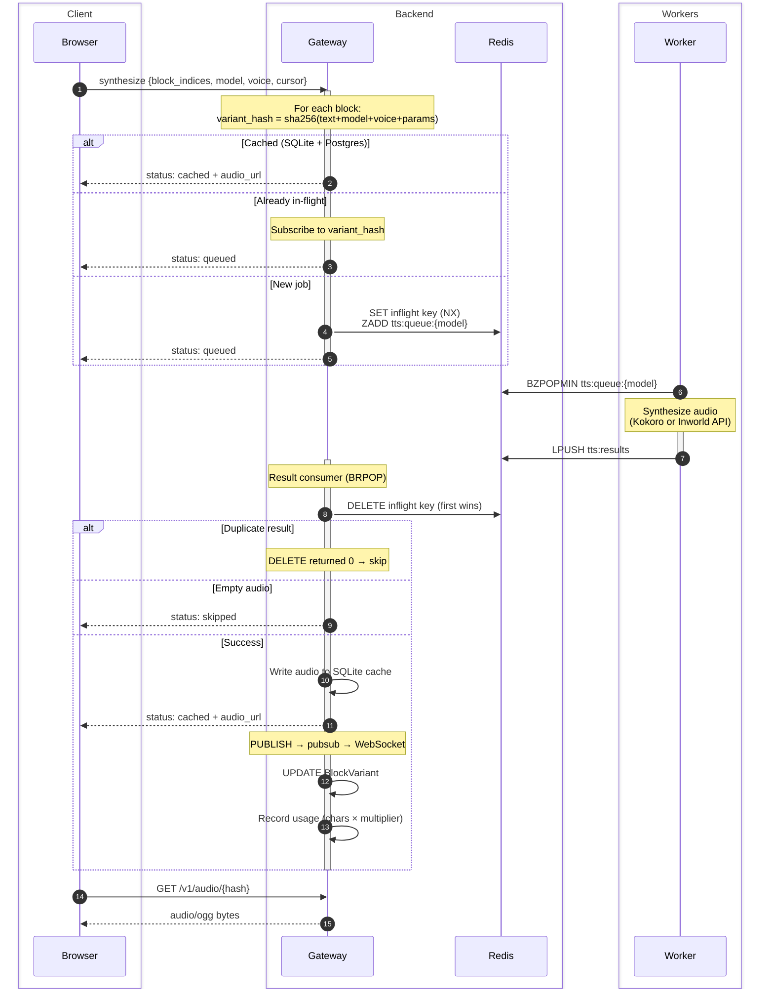

## 2. Document AI Extraction (non-batch)

**Replaces:** `architecture.md` lines 162-199 (ASCII sequence diagram)

Shows the Gemini-based extraction flow for PDFs/images. This is the
*non-batch* path — batch mode submits all pages to the Gemini Batch API
instead, with a background poller checking for completion (50% cost
reduction).

**Improvements:** `loop` for polling, `par` for per-page parallelism,
activation bars, proper branching with `alt`. The ASCII version used
`─ ─ ─(async)─ ─ ─` freehand annotation to show async behavior — Mermaid
makes this structural.

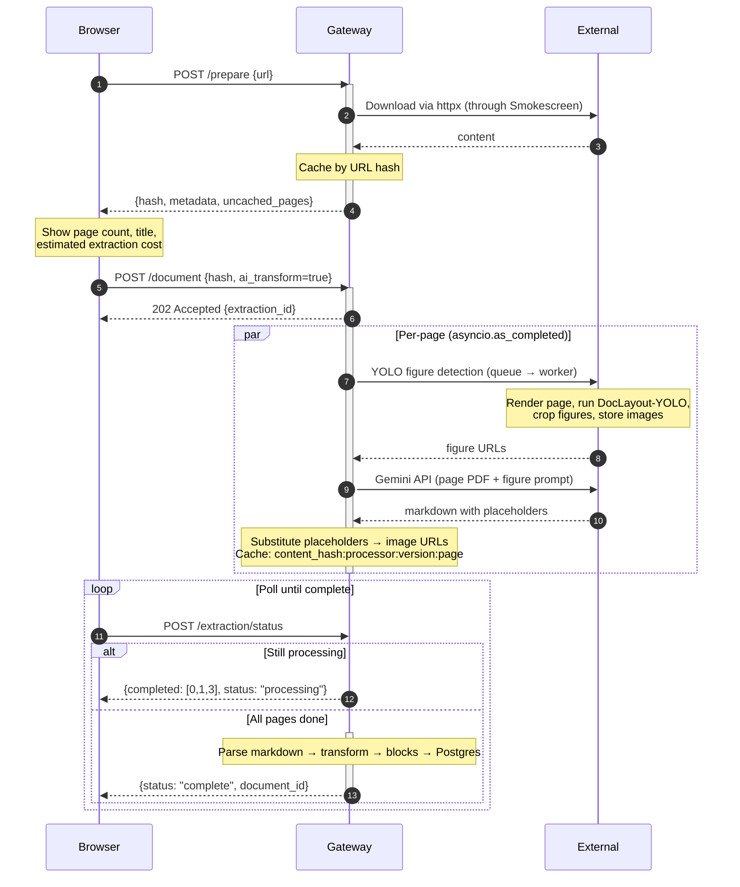

## 3. Per-Block Synthesis Flow

**Replaces:** `tts-pipeline.md` lines 62-88 (ASCII flowchart)

**Improvements:** Decision diamonds render cleanly without manual box-drawing.
The ASCII version needed careful column alignment for every branch.
Added subscriber tracking step (matches actual code order).

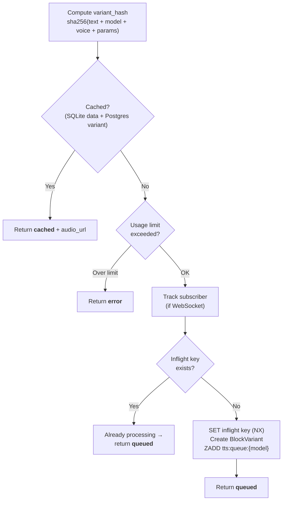

## 4. Input Paths

**Replaces:** `document-processing.md` lines 12-39 (ASCII flowchart)

**Improvements:** Three entry points converging is natural for flowcharts.
The ASCII version had careful column alignment for three parallel paths
that broke on edits. Mermaid handles the layout automatically.

**Accuracy fix:** arXiv detection happens in *both* the website and document
paths. `/website` calls `extract_website_content()` which checks
`detect_arxiv_url()`. `/document` also checks for arXiv URLs (when
`ai_transform=false`). Both route to the Markxiv sidecar.

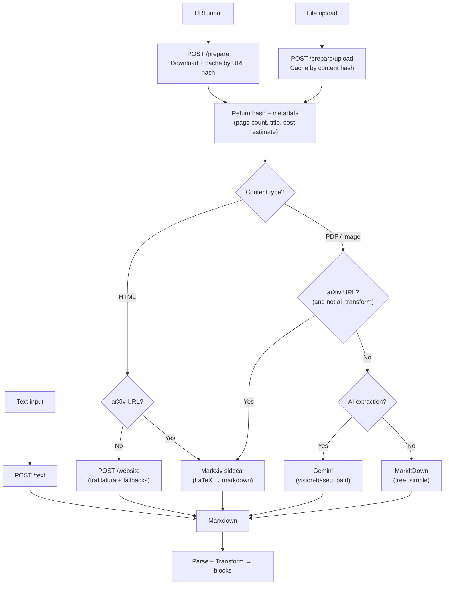

## 5. Website Extraction

**Replaces:** `document-processing.md` lines 49-62 (ASCII tree)

**Improvements:** Decision branches with fallback paths. The ASCII version
was a pseudo-tree with `├──` and `└──` that couldn't show the full flow
without getting unwieldy.

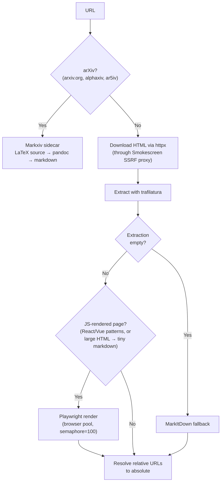

## 6. PDF/Image Extraction Pipeline

**Replaces:** `document-processing.md` lines 83-102 (ASCII tree)

**Improvements:** Shows the parallel nature (YOLO + page extraction happen
concurrently via `asyncio.as_completed`). The ASCII version was strictly
sequential which misrepresented the actual flow.

```mermaid
flowchart TD
    PDF["PDF bytes"] --> PAGES["Extract per-page PDFs<br/>(pymupdf)"]

    PAGES --> YOLO["YOLO figure detection<br/>(queue → worker)"]
    YOLO --> CROPS["Crop figures, store images<br/>(local FS or Cloudflare R2)"]

    PAGES --> PROMPT["Build Gemini prompt<br/>with figure placeholders"]
    CROPS --> PROMPT

    PROMPT --> GEMINI["Send page PDF + prompt<br/>to Gemini API"]
    GEMINI --> SUB["Substitute placeholders<br/>→ actual image URLs"]
    SUB --> CACHE["Cache per page<br/>content_hash:processor:version:page_idx"]

    style YOLO fill:#4a3728
    style GEMINI fill:#283748
```

## 7. Result Consumer

**Replaces:** `tts-pipeline.md` lines 165-178 (ASCII tree)

**Improvements:** Shows the branching clearly. The ASCII version used
`├──` tree notation with inline steps that mixed control flow and data flow.

**Accuracy fix:** Notification happens before DB update in actual code.

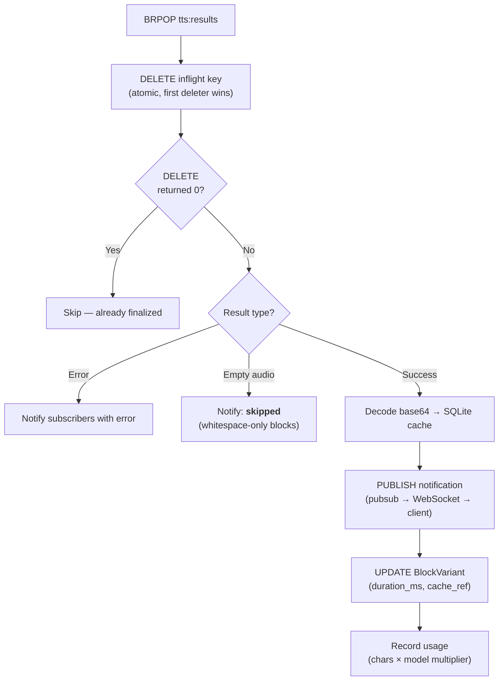

## 8. Visibility + Overflow Scanners

**Replaces:** `tts-pipeline.md` lines 193-207 (two small ASCII trees)

**Improvements:** Combined into one diagram showing both reliability
mechanisms and how they feed back into the queue.

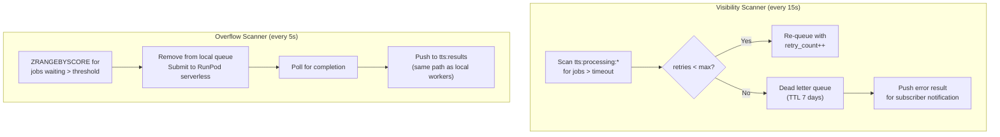

## 9. System Architecture

**Replaces:** `architecture.md` lines 11-60 (big ASCII box diagram)

The core insight: follow the request path top-to-bottom instead of trying
to spatially contain everything. Fewer subgraphs, let the flow direction
convey hierarchy. RunPod and external APIs are outside the swarm boundary.

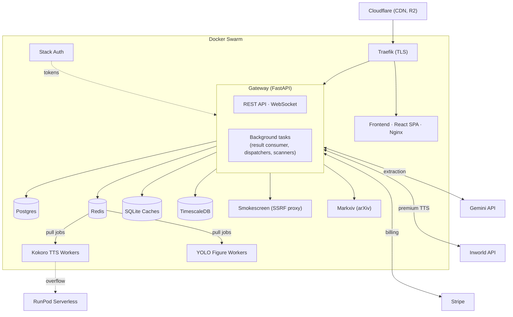

Kokoro and YOLO are separate containers that pull directly from Redis
(`BZPOPMIN`). Inworld dispatchers also use Redis queues but live *inside*
the gateway (listed under "Background tasks") — they pull from
`tts:queue:inworld-*` and POST to the external API. So all worker paths
go through Redis, but only Kokoro/YOLO show a direct Redis edge because
they're the only ones with Redis as their sole interface.

## 10. Block Splitting

**Replaces:** `document-processing.md` lines 159-166 (ASCII tree)

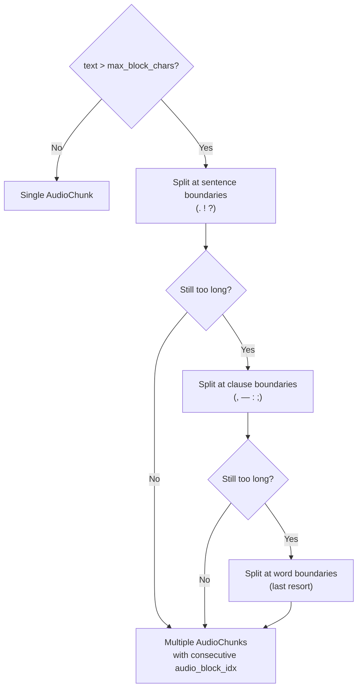

## 11. TTS Pipeline Overview

**Replaces:** `tts-pipeline.md` lines 10-17 (ASCII box chain)

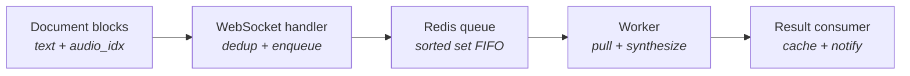

---

## Summary

| # | Diagram | Source | Mermaid type | Verdict |
|---|---------|--------|--------------|---------|
| 1 | Synthesis lifecycle | architecture.md | sequenceDiagram | Clear win — activations, alt blocks, notes |
| 2 | AI extraction (non-batch) | architecture.md | sequenceDiagram | Clear win — loop, par, activation bars |
| 3 | Per-block synthesis | tts-pipeline.md | flowchart | Clear win — decision diamonds |
| 4 | Input paths | document-processing.md | flowchart | Clear win — 3 converging paths |
| 5 | Website extraction | document-processing.md | flowchart | Clear win — fallback chains |
| 6 | PDF extraction | document-processing.md | flowchart | Better — shows parallelism |
| 7 | Result consumer | tts-pipeline.md | flowchart | Better — clean branching |
| 8 | Scanners | tts-pipeline.md | flowchart | Better — combined + clearer |
| 9 | System architecture | architecture.md | architecture-beta | Try it — fallback to flowchart if unsupported |
| 10 | Block splitting | document-processing.md | flowchart | Clear win — cascading fallback |
| 11 | Pipeline overview | tts-pipeline.md | flowchart LR | Slight win — auto-aligned |

**Accuracy fixes applied:**
- Result consumer: notification before DB update (matches code)
- Per-block flow: subscriber tracking before inflight check
- Input paths: arXiv check shown in BOTH website and document paths (was only on document path)
- Document creation: renamed to "AI Extraction (non-batch)" — only covers Gemini path, not general creation
- System architecture: RunPod is CPU serverless, not GPU overflow
- Website extraction: trafilatura emptiness check triggers MarkItDown fallback (was underspecified)
