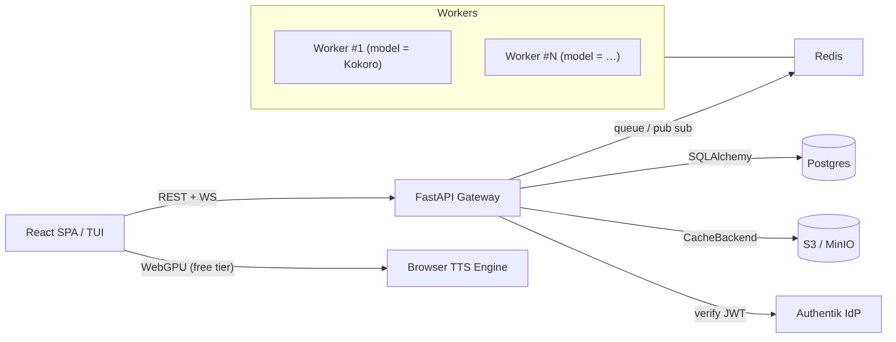
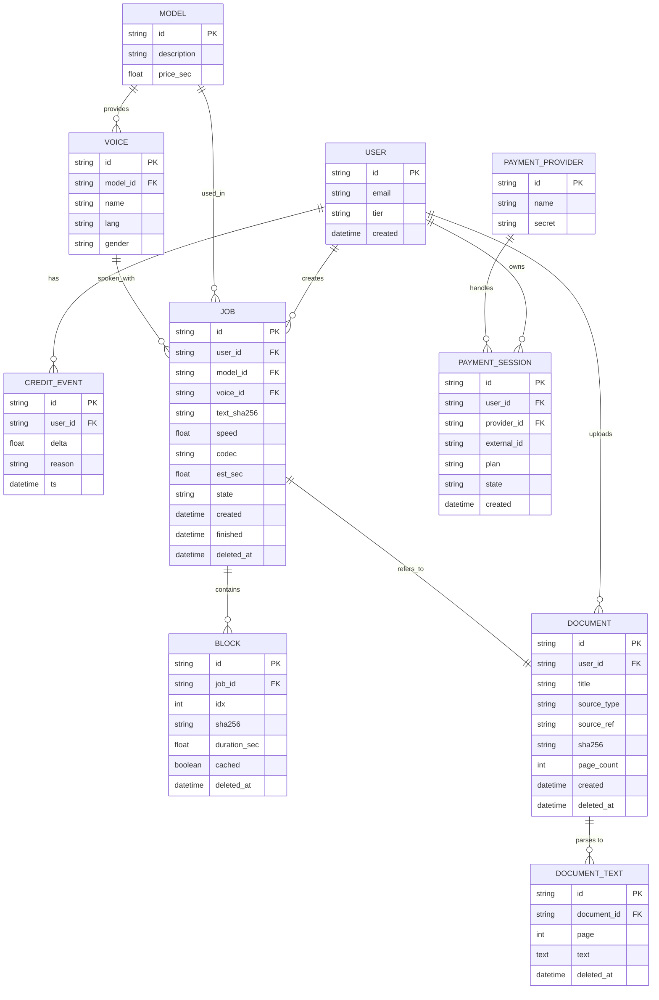

# Yapit

## 🚀Mission & Goals
* **What**–A modular Text‑to‑Speech service & UI that reads documents, web pages and arbitrary text with real‑time highlighting.
* **Why**–Make long‑form reading accessible (eyes‑free, inclusive, multitasking). Free‑tier runs fully in‑browser – costs us **zero**.
* **How**–Pluggable models behind a uniform API, OSS‑first.

## 💡Philosophy  
*(core ideas that guide every decision)*
- **OSS‑First Core**–Gateway, frontend and model adapters are MIT/Apache‑2.0; no closed glue.
- **Modular Adapters**–Every TTS engine (Kokoro, nari-labs/Dia-1.6B, browser WebGPU, (ElevenLabs? - too expensive upfront for now)) lives behind the same protocol.
- **Minimal Ops Overhead**–`docker compose up` gives a full dev stack; prod runs on a single VPS + optional GPUs or serverless workers.
- **Zero Overhead for Paying Users; Freedom for OSS Tinkerers**–Self‑host build works without S3, Stripe, or GPUs.
- **Pay‑for‑What‑You‑Use**–1 credit ≈ 1s audio (or 1 char?), per‑model multipliers.
- **Metric‑Driven Iteration**– Ship simple, measure, replace when pain shows.

## 💡 Philosophy
- **OSS‑First Core:** Frontend, gateway, model‑adapters MIT/Apache‑2.0 (or GPL?).
- **Modular Adapters:** Hide each TTS engine (Kokoro, nari-labs/Dia-1.6B, ElevenLabsAPI?) behind a uniform API.  
- **Minimal Ops Overhead for Devs:** “Just docker-compose up” on CPU or GPU.
- **Zero overhead for paying users; Freedom for OSS tinkerers:** Options for self-hosted models, browser, cloud, or hybrid.
- **Pay‑for‑What‑You‑Use:** 1 credit 1 sec (or 1 char?, multiplier for more expensive models).

## 🏗️ High‑level Architecture


*Workers can run on dedicated GPU/CPU hosts, pods or serverless runners (RunPod, Modal, Lambda) – only Redis connectivity is required.*

## 🌐Public API(v1)

### Catalogue
| method | path                           | notes                                          |
|--------|--------------------------------|------------------------------------------------|
| `GET`  | `/v1/models`                   | List models with `price_sec`, `default_voice`. |
| `GET`  | `/v1/models/{model_id}/voices` | Voices for the given model.                    |

### Synthesis
| method   | path                        | body / notes                                                    |
|----------|-----------------------------|-----------------------------------------------------------------|
| `POST`   | `/v1/models/{model_id}/tts` | `{text, voice, speed, codec}` → `201 {job_id, ws_url, est_sec}` |
| `WS`     | `/v1/ws/{job_id}`           | Streams Opus/PCM blocks + control frames.                       |
| `GET`    | `/v1/jobs/{job_id}`         | `{state, seconds_done, seconds_total}` progress.                |
| `DELETE` | `/v1/jobs/{job_id}`         | Cancel running job.                                             |
| `GET`    | `/v1/audio/{sha256}`        | Block download, Range‑enabled.                                  |

### Billing & Credits _(provider‑agnostic)_
| method | path                             | purpose                                                   |
|--------|----------------------------------|-----------------------------------------------------------|
| `POST` | `/v1/billing/checkout`           | Create payment session `{plan, provider}` → checkout URL. |
| `POST` | `/v1/billing/webhook/{provider}` | Provider webhook → credit events.                         |
| `GET`  | `/v1/users/me/credits`           | Remaining credits & usage.                                |

### Auth & Profile
| method | path           | purpose                |
|--------|----------------|------------------------|
| `GET`  | `/v1/users/me` | Basic profile details. |


## 🗄️Domain Data Model (SQLAlchemy2)

```text
user(id PK, email, tier, created)

credit_event(id PK, user_id FK, delta, reason, ts)

model(id PK, description, price_sec)
voice(id PK, model_id FK, name, lang, gender)

job(id PK, user_id FK, model_id FK, voice_id FK,
    text_sha256, speed, codec, est_sec,
    state, created, finished,
    deleted_at TIMESTAMP NULL)

block(id PK, job_id FK, idx, sha256,
      duration_sec, cached BOOL,
      deleted_at TIMESTAMP NULL)

payment_provider(id PK, name, secret)
payment_session(id PK, user_id FK, provider_id FK,
                external_id, plan, state, created)

document(                 -- optional: only if you persist uploads
    id PK, user_id FK, title,
    source_type, source_ref, sha256, page_count,
    created, deleted_at TIMESTAMP NULL)

document_text(            -- store parsed plaintext / glyph-map
    id PK, document_id FK, page INT, text TEXT,
    /* char-bbox JSON could live in S3; TBD later */,
    deleted_at TIMESTAMP NULL)

```



## 🗂️ Cache Strategy
* **Key**–`sha256(model|voice|speed|text_block)`.
* **Backends**
  * `s3`→S3/MinIO, life‑cycle rule: expire *N* days after last access (start simple; upgrade to Redis‑driven LRU when metrics demand).
  * `fs`→local directory (dev / on‑prem).
  * `noop`→no server‑side storage; browser persists blocks in `indexedDB`.

## 🔐 Auth
* **Authentik** – single container OIDC/JWT, MFA, Google, GitHub, email+pwd.
* Gateway verifies JWT once per request with `python‑jose`.

## 💸 Billing
* **Pluggable payment adapters** (`stripe`, `paypal`, …)

## 📋 Feature Backlog (loosely ordered, but can mostly be worked on in parallel)
1. **Gateway / Backend**
   1. API
   2. ORM + Alembic migration `0001_initial`  *(WIP)*
   3. Progress endpoint with online metering.
   4. Cache backend drivers + metrics.
2. **Auth & Billing**
   1. Authentik deployment script.
   2. Stripe adapter prototype _(open: evaluate PayPal fees & API)_.
3. **Frontend MVP**
   1. Model / voice selector, play/pause, block‑seek progress bar.
   2. WebGPU/WASM fallback (transformers.js) for free tier.
4. **Persistence & Tracking**
   1. Redis hash for offsets, periodic flush to Postgres.
   2. Credit debits on `block` completion.
5. **Additional Models** – integrate nari-labs/Dia-1.6B.
6. **Document Parsing** – OCR (VLLM), regex filters, natural language filters.
7. **Monitoring & QA** – Prometheus, Grafana, e2e tests.
8. **Optimisations** – Opus encoding, ...
9. **Documentation & Community** – README, Discord, blog post.

## 📜 Style & Tooling
* **Python** 3.12, Ruff for lint+format. Typehinted code.
* **Conventional Commits** for changelog.
* **CI**

## ❓ Open Questions / TBD
* 10 vs 20s audio blocks? (considerations: gpu util, queue time, pbar jumping)
* Payment provider(s)
* Cache strategies (LRU / expire / hybrid).
* Pricing multipliers per premium model.
* Long‑term user‑storage (S3).

## 🔧 Current State
- ✅ Docker‑Compose skeleton (redis, postgres, minio, gateway, lightweight kokoro CPU/GPU workers).  
- (in progress) React frontend scaffold [basic communication functionality]
