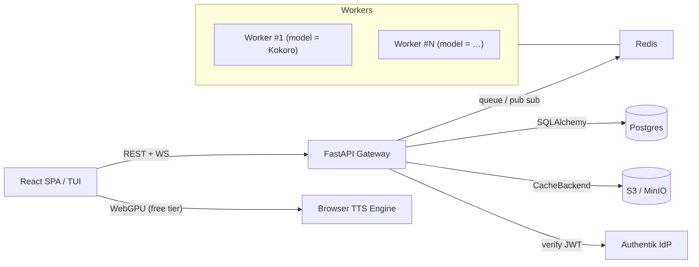

# Yapit

## 🚀Mission & Goals
* **What**–A modular Text‑to‑Speech service & UI that reads documents, web pages and arbitrary text with real‑time highlighting.
* **Why**–Make long‑form reading accessible (eyes‑free, inclusive, multitasking). Free‑tier runs fully in‑browser – costs us **zero**.
* **How**–Pluggable models behind a uniform API, OSS‑first.

## 💡Philosophy  
*(core ideas that guide every decision)*
- **OSS‑First Core**–Gateway, frontend and model adapters are MIT/Apache‑2.0; no closed glue.
- **Modular Adapters**–Every TTS engine (Kokoro, nari-labs/Dia-1.6B, browser WebGPU, (ElevenLabs?)) lives behind the same protocol.
- **Minimal Ops Overhead**–`docker compose up` gives a full dev stack; prod runs on a single VPS + optional GPUs or serverless workers.
- **Zero Overhead for Paying Users; Freedom for OSS Tinkerers**–Self‑host build works without S3, Stripe, or GPUs.
- **Pay‑for‑What‑You‑Use**–1 credit ≈ 1s audio (or 1 char?), per‑model multipliers.
- **Metric‑Driven Iteration**– Ship simple, measure, replace when pain shows.

## 💡 Philosophy
- **OSS‑First Core:** Frontend, gateway, model‑adapters MIT/Apache‑2.0 (or GPL?).
- **Modular Adapters:** Hide each TTS engine (Kokoro, nari-labs/Dia-1.6B, ElevenLabsAPI?) behind a uniform API.  
- **Minimal Ops Overhead for Devs:** “Just docker-compose up” on CPU or GPU.
- **Zero overhead for paying users; Freedom for OSS tinkerers:** Options for self-hosted models, browser, cloud, or hybrid.
- **Pay‑for‑What‑You‑Use:** 1 credit 1 sec (or 1 char?, multiplier for more expensive models).

## 🏗️ High‑level Architecture


*Workers can run on dedicated GPU/CPU hosts, pods or serverless runners (RunPod, Modal, Lambda) – only Redis connectivity is required.*

## 🌐Public API(v1)

### Catalogue
| method | path | notes |
|---|---|---|
| `GET` | `/v1/models` | List models with `price_sec`, `default_voice`. |
| `GET` | `/v1/models/{model_id}/voices` | Voices for the given model. |

### Synthesis
| method | path | body / notes |
|---|---|---|
| `POST` | `/v1/models/{model_id}/tts` | `{text, voice, speed, codec}` → `201 {job_id, ws_url, est_sec}` |
| `WS` | `/v1/ws/{job_id}` | Streams Opus/PCM blocks + control frames. |
| `GET` | `/v1/jobs/{job_id}` | `{state, seconds_done, seconds_total}` progress. |
| `DELETE` | `/v1/jobs/{job_id}` | Cancel running job. |
| `GET` | `/v1/audio/{sha256}` | Block download, Range‑enabled. |

### Billing & Credits _(provider‑agnostic)_
| method | path | purpose |
|---|---|---|
| `POST` | `/v1/billing/checkout` | Create payment session `{plan, provider}` → checkout URL. |
| `POST` | `/v1/billing/webhook/{provider}` | Provider webhook → credit events. |
| `GET` | `/v1/users/me/credits` | Remaining credits & usage. |

### Auth & Profile
| method | path | purpose |
|---|---|---|
| `GET` | `/v1/users/me` | Basic profile details. |


## 🗄️Domain Data Model (SQLAlchemy2)
```text
user(id PK, email, tier, created)
credit_event(id PK, user_id FK, delta, reason, ts)
model(id PK, description, price_sec)
voice(id PK, model_id FK, name, lang, gender)
job(id PK, user_id FK, model_id FK, voice_id FK,
    text_sha256, speed, codec, est_sec, state, created, finished)
block(id PK, job_id FK, idx, sha256, duration_sec, cached BOOL)
payment_provider(id PK, name, secret)
payment_session(id PK, user_id FK, provider_id FK,
                external_id, plan, state, created)
```

## 🗂️ Cache Strategy
* **Key**–`sha256(model|voice|speed|text_block)`.
* **Backends**
  * `s3`→S3/MinIO, life‑cycle rule: expire *N* days after last access (start simple; upgrade to Redis‑driven LRU when metrics demand).
  * `fs`→local directory (dev / on‑prem).
  * `noop`→no server‑side storage; browser persists blocks in `indexedDB`.

## 🔐 Auth
* **Authentik** – single container OIDC/JWT, MFA, Google, GitHub, email+pwd.
* Gateway verifies JWT once per request with `python‑jose`.


## 💸 Billing
* **Pluggable payment adapters** (`stripe`, `paypal`, `paddle`, …)
* **TBD** – Decide default provider (Stripe easiest; PayPal considered for EU users).   

Adapter swap requires no gateway changes.

## 📋 Feature Backlog
1. **Gateway / Backend**
   1. ORM + Alembic migration `0001_initial`  *(WIP)*
   2. Progress endpoint with online metering.
   3. Cache backend drivers + metrics.
2. **Auth & Billing**
   1. Authentik deployment script.
   2. Stripe adapter prototype _(open: evaluate PayPal fees & API)_.
3. **Frontend MVP**
   1. Model / voice selector, play/pause, block‑seek progress bar.
   2. WebGPU fallback (transformers.js) for free tier.
4. **Persistence & Tracking**
   1. Redis hash for offsets, periodic flush to Postgres.
   2. Credit debits on `block` completion.
5. **Additional Models** – integrate ElevenLabs API adapter.
6. **Document Parsing** – OCR + VLLM summariser.
7. **Monitoring & QA** – Prometheus, Grafana, e2e tests.
8. **Optimisations** – Opus encoding server‑side streaming, SIMD improvements.
9. **Documentation & Community** – README, Discord, blog post.


## 🛣️ Roadmap (next 90 days)
| week | milestone |
|------|-----------|
| 1‑2 | Alembic migration, cache drivers, progress endpoint. |
| 3‑4 | Authentik live, Stripe sandbox, basic React player. |
| 5‑6 | Metrics → Grafana, Opus streaming, serverless worker PoC. |
| 7‑8 | ElevenLabs adapter, paid tier launch, blog post. |
| 9‑12 | PDF/OCR pipeline, PayPal adapter decision, public beta. |


## 📜 Style & Tooling
* **Python** 3.12, Ruff for lint+format, mypy strict.
* **CI** – GitHub Actions builds gateway + workers, runs lint.
* **Conventional Commits** for changelog.


## ❓ Open Questions / TBD
* Which payment provider ships first (Stripe vs PayPal)?
* Final cache \(LRU vs S3 Intel‑Tier) once real metrics arrive.
* Pricing multipliers per premium model.
* Long‑term user‑storage (MinIO vs cloud S3).


## 🔧 Current State (needs heavy refactoring & adaptations)
- ✅ Docker‑Compose skeleton (redis, postgres, minio, gateway, CPU/GPU workers).  
- ✅ Kokoro pipeline shared library, CPU & GPU images working.  
- ✅ Quick‑test script (`scripts/smoke_test.py`) writes `sample.wav`.  
- ✅ CI: GitHub Action builds all images on push.
- (in progress) React frontend scaffold [basic communication functionality]

## 🛠️ TODOs / Featurelist (loosely ordered, but can mostly be worked on in parallel)
1. **Gaetway / Backend**
   - ORM? If yes, SQLAlchemy+Alembic? 
   - Full API
2. **Auth & Billing**  
   - find a leaner / less bloated alternative to Zitadel; OIDC → JWT validation. Login with Google, Github.
3. **Frontend MVP**  
   - Voice/lang selector, play/pause, highlight.
   - Support for WebGPU models via transformers.js.
4. **Progress Persistence**  
   - Redis hash for offsets, periodic flush to Postgres.
   - Creidt / usage tracking.
5. **Additional Models**  
   - UI: Model selector 
6. **OCR, LLM & traditional parsing / filtering**
   - Support common document formats; VLLM-backed.
   - Support for web pages
7. **Payment Processing**  
   - Stripe integration for credit purchases.
   - Monthly subscription plans.
8. **Webhosting & Serverless Deployment**  
   - Deploy main app on dedicated VPS (e.g. Hetzner).
   - Serverless model inference (e.g. via runpod.io).
   - Persistent storage for user data (e.g. S3, Postgres).
9. **Testing & QA**  
   - Write unit tests for the core components? (at least for billing&auth)
   - Set up a staging environment for testing new features?
   - Implement monitoring and alerting for production systems.
10. ** Optimizations**
   - Opus encoding for audio streaming.
12. **Documentation & Community**  
    - Write a README for the repo (how to run it, how to self-host different models)
    - Create a Discord server for community support?
    - Write a blog post about the project.
13. **Ship it**
