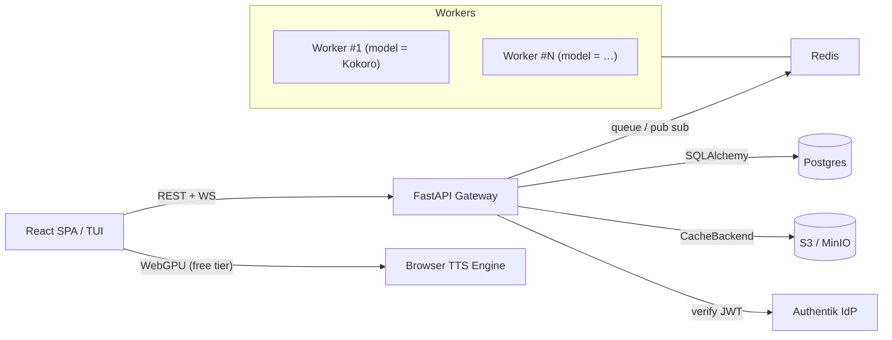

# Yapit

## 🚀Mission & Goals
* **What**–A modular Text‑to‑Speech service & UI that reads documents, web pages and arbitrary text with real‑time highlighting.
* **Why**–Make long‑form reading accessible (eyes‑free, inclusive, multitasking). Free‑tier runs fully in‑browser – costs us **zero**.
* **How**–Pluggable models behind a uniform API, OSS‑first.

## 💡Philosophy  
- **OSS‑First Core**–Gateway, frontend and model adapters are MIT/Apache‑2.0; no closed glue.
- **Modular Adapters**–Every TTS engine (Kokoro, nari-labs/Dia-1.6B, browser WebGPU, (ElevenLabs? - too expensive upfront for now)) lives behind the same protocol.
- **Minimal Ops Overhead**–`docker compose up` gives a full dev stack; prod runs on a single VPS + optional GPUs or serverless workers.
- **Zero Overhead for Paying Users; Freedom for OSS Tinkerers**–Self‑host build works without S3, Stripe, optionally GPUs.
- **Pay‑for‑What‑You‑Use**–1 credit ~ 1s audio (or 1 char?), per‑model multipliers.
- **Metric‑Driven Iteration**–Ship simple, measure, replace when pain shows.

## 🏗️ High‑level Architecture


*Workers can run on dedicated GPU/CPU hosts, pods or serverless runners (RunPod, Modal, Lambda) – only Redis connectivity is required.*

## 🌐Public API(v1)


## 🗄️Domain Data Model

(TODO update once model is stable - for now the code is the source of truth)

```mermaid
```

```mermaid
```

Stack: SQLAlchemy + SQLModel + Alembic

## 🗂️ Cache Strategy
* **Key**–`sha256(model|voice|speed|text_block)`.
* **Backends**
  * `s3`→S3/MinIO, life‑cycle rule: expire *N* days after last access (start simple; upgrade to Redis‑driven LRU when metrics demand).
  * `fs`→local directory (dev / on‑prem).
  * `noop`→no server‑side storage; browser persists blocks in `indexedDB`.

## 🔐 Auth
* **Authentik** – single container OIDC/JWT, MFA, Google, GitHub, email+pwd.
* Gateway verifies JWT once per request with `python‑jose`.

## 💸 Billing
* **Pluggable payment adapters** (`stripe`, `paypal`, …)

## 📋 Feature Backlog (loosely ordered, but can mostly be worked on in parallel)
1. **Gateway / Backend**
   1. API
   2. ORM + Alembic migration `0001_initial`  *(WIP)*
   3. Progress endpoint with online metering.
   4. Cache backend drivers + metrics.
2. **Auth & Billing**
   1. Authentik deployment script.
   2. Stripe adapter prototype _(open: evaluate PayPal fees & API)_.
3. **Frontend MVP**
   1. Model / voice selector, play/pause, block‑seek progress bar.
   2. WebGPU/WASM fallback (transformers.js) for free tier.
4. **Persistence & Tracking**
   1. Redis hash for offsets, periodic flush to Postgres.
   2. Credit debits on `block` completion.
5. **Additional Models** – integrate nari-labs/Dia-1.6B.
6. **Document Parsing** – OCR (VLLM), regex filters, natural language filters.
7. **Monitoring & QA** – Prometheus, Grafana, e2e tests.
8. **Optimisations** – Opus encoding, ...
9. **Documentation & Community** – README, Discord, blog post.

## 📜 Style & Tooling
* **Python** 3.13, Ruff for lint+format. Typehinted code.
* **Conventional Commits** for changelog.
* **CI**

## ❓ Open Questions / TBD
* 10 vs 20s audio blocks? (considerations: gpu util, queue time, pbar jumping)
* Payment provider(s)
* Cache strategies (LRU / expire / hybrid).
* Pricing multipliers per premium model.
* Long‑term user‑storage (S3).

## 🔧 Current State
- ✅ Docker‑Compose skeleton (redis, postgres, minio, gateway, lightweight kokoro CPU/GPU workers).  
- (in progress) React frontend scaffold [basic communication functionality]
