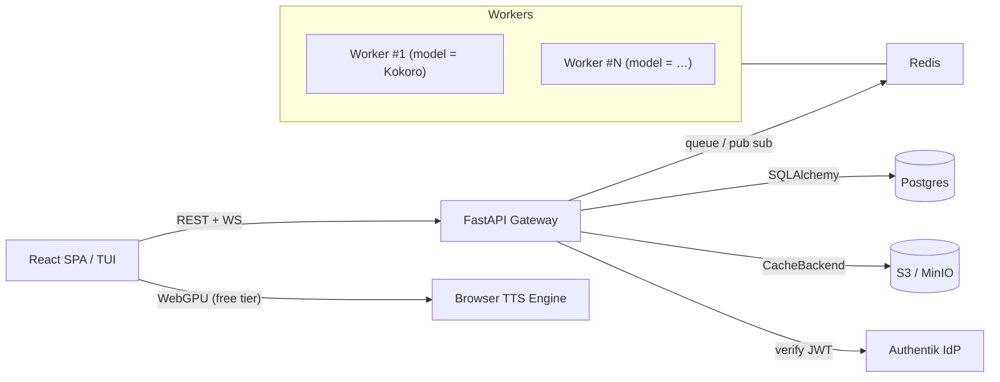

# Yapit

## 🚀Mission & Goals
* **What**–A modular Text‑to‑Speech service & UI that reads documents, web pages and arbitrary text with real‑time highlighting.
* **Why**–Make long‑form reading accessible (eyes‑free, inclusive, multitasking). Free‑tier runs fully in‑browser – costs us **zero**.
* **How**–Pluggable parsing, filtering, synthesizing, ui, caching, billing, auth, monitoring, etc.

## 💡Philosophy  
- **OSS‑First**: Gateway, frontend and model adapters are MIT/Apache‑2.0/GPLv3+
- **Modular**: Every TTS engine (Kokoro, nari-labs/Dia-1.6B, browser WebGPU, (ElevenLabs? - too expensive upfront for now)) lives behind the same protocol.
- **Minimal Ops Overhead**– Runs on a single VPS + optional GPUs or serverless workers.
- **Zero Overhead for Paying Users; Freedom for OSS Tinkerers**–Self‑host build works without S3, Stripe, optionally GPUs.
- **Pay‑for‑What‑You‑Use**–1 credit ~ 1s audio (or 1 char?), per‑model multipliers.
- **Metric‑Driven Iteration**–Short iteration cycle. Ship simple (but complex enough), measure, replace when pain shows.

## 🏗️ High‑level Architecture

*Workers can run on dedicated GPU/CPU hosts, pods or serverless runners (RunPod, Modal, Lambda) – only Redis connectivity is required.*

## 🌐Public API(v1)

See [OpenAPI](http://localhost:8000/docs) for details.

## 🗄️Domain Data Model

## 🗂️ Cache Strategy
* **Key**–`sha256(model|voice|speed|text_block)`.
* **Backends**
  * `s3`→S3/MinIO, life‑cycle rule: expire *N* days after last access (start simple; upgrade to Redis‑driven LRU when metrics demand).
  * `fs`→local directory (dev / on‑prem).
  * `noop`→no server‑side storage; browser persists blocks in `indexedDB`.

## 🔐 Auth
* **Authentik** – single container OIDC/JWT, MFA, Google, GitHub, email+pwd.
* Gateway verifies JWT once per request with `python‑jose`.

## 💸 Billing
* **Pluggable payment adapters** (`stripe`, `paypal`, …)

## 📋 High-level Roadmap
1. **Gateway / Backend**
   1. API (wip)
   2. ORM (wip) + Alembic migration `0001_initial` 
   3. Cache backends (wip) + metrics.
2. **Auth & Billing**
   1. Authentik
   2. Stripe adapter (PayPal?).
   3. Credit debits on `block` completion.
3. **Frontend MVP**
   1. Model / voice selector, play/pause, block‑seek progress bar. (wip)
   2. WebGPU/WASM fallback (transformers.js) for free tier.
4. **Library** - store documents in s3
5. **Additional Models** – integrate nari-labs/Dia-1.6B.
6. **Document input** – OCR (VLLM), regex filters, natural language filters.
7. **Url input**
8. **Monitoring & QA** – Prometheus, Grafana, e2e tests.
9. **Optimizations** – Opus encoding, ...
10. **Documentation & Community** – README, Discord, blog post.
